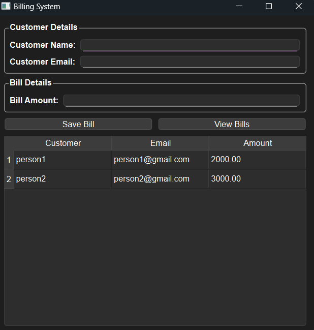

---

# **BillingApp** 🧾  

A **desktop-based Billing System** built using **PySide6 (Python GUI framework) and MySQL**, allowing users to manage customer bills with a clean and intuitive UI.  

---

## 🎥 Demo Video  
[![Watch the demo]](https://drive.google.com/file/d/1VxsEeu8TihB4lCEFZetqrm0KnJl6n16P/view?usp=sharing)

---

## **🚀 Features**  
✔ **Add Customers** – Save customer details (name & email).  
✔ **Add Bills** – Store billing amounts linked to customers.  
✔ **View Bills** – Display saved bills in a table.  
✔ **Database Integration** – Uses **MySQL** for storage.  
✔ **Modular Codebase** – Well-structured **MVC architecture**.  

---

## **📦 Installation**  

### **1️⃣ Clone the Repository**  
```bash
git clone https://github.com/your-username/BillingApp.git
cd BillingApp
```

### **2️⃣ Install Dependencies**  
Make sure you have **Python 3.9+** installed. Then, install dependencies:  
```bash
pip install -r requirements.txt
```

### **3️⃣ Configure Environment Variables**  
- **Rename** `.env.example` to `.env` and update your MySQL credentials:  
 
---

## **▶ Running the Application**  

You can run the app using either of the following commands:  

```bash
python -m app.main
```
or  
```bash
python app/main.py
```

---

## **💾 Database Setup**  
- The **database and tables are automatically created** when you run the application.  
- Uses **MySQL** as the backend storage.  

---

## **📷 Screenshots**  
### 💡 Billing App UI
 

---
